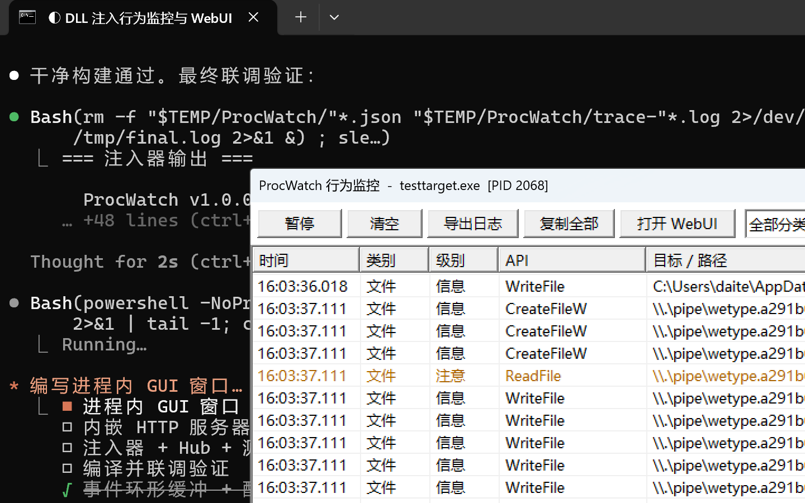
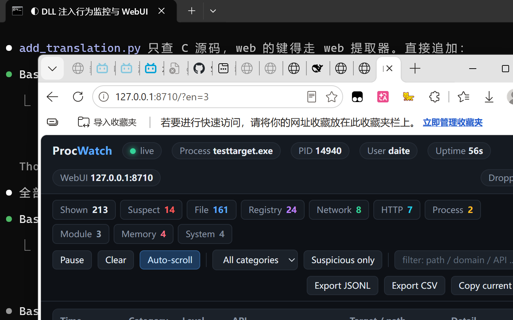

# ProcWatch — process behaviour monitor

[](https://github.com/Slingerspir/procwatch/actions/workflows/build.yml)

[中文说明](README.md)

A DLL you inject into any Windows process so you can watch what that process
actually does: which files it reads and writes, which registry keys it touches,
which addresses it connects to, what it sends over HTTP, which proxy it uses,
what it launches, which modules it loads and what memory it asks for.

Once injected, the target grows a monitor window of its own and an embedded
WebUI on a loopback port, both showing the same live data. A test target is
included — it walks through every one of those behaviours on purpose, so you can
verify the monitor actually catches them.





---

## Quick start

```bat
:: 1. build (needs MinGW-w64 gcc on PATH)
make

:: 2. start the aggregation hub and inject the test target
dist\injector.exe --exe dist\testtarget.exe --hub

:: 3. open the hub, click into the process
::    http://127.0.0.1:8700/
```

Into something already running:

```bat
dist\injector.exe --list                  :: see what is already instrumented
dist\injector.exe --pid 1234              :: inject into PID 1234
dist\injector.exe --pid 1234 --previews=1 :: and capture payload previews
```

Build output:

| File | What it is |
|---|---|
| `dist/ProcWatch.dll` | the injectable monitor (x64) |
| `dist/injector.exe` | injector and aggregation hub |
| `dist/testtarget.exe` | the behaviour test target |

## Injector usage

```
injector.exe --exe <program> [-- <args for the target>]   launch and inject
injector.exe --pid <PID>                                  inject into a running process
injector.exe --list                                       list instrumented processes
injector.exe --hub [--hub-port N]                         start the aggregation hub
```

| Option | Default | Meaning |
|---|---|---|
| `--dll <path>` | `ProcWatch.dll` beside the exe | DLL to inject |
| `--gui=0\|1` | 1 | in-process monitor window |
| `--http=0\|1` | 1 | embedded WebUI server |
| `--port=N` | auto | WebUI port (probes upward from 8710) |
| `--log=0\|1` | 0 | also mirror events to `%TEMP%\ProcWatch\logs\` |
| `--previews=0\|1` | 0 | capture data previews (text or hex) |
| `--risk=0\|1` | 1 | heuristic risk rules |
| `--lang=auto\|zh\|en` | auto | interface language |
| `--verbose=0\|1` | 0 | log high-frequency APIs (every `GetProcAddress`) |
| `--ring=N` | 8192 | event ring capacity |

Everything after `--` goes to the target verbatim, and so does anything else the
injector does not recognise.

### When the target requires administrator rights

If the target's manifest asks for `requireAdministrator` (many game launchers
do), `CreateProcess` fails with **error 740** (`ERROR_ELEVATION_REQUIRED`). The
injector then **re-launches itself elevated through UAC**, forwarding the
original command line verbatim, and continues in the new window.

The same applies to injecting into a process that is already running at a higher
integrity level: `OpenProcess` is denied, and the injector has to be elevated
too. Neither case is helped by `SE_DEBUG` — only elevation works.

Use `--no-elevate` to turn the automatic relaunch off and be told what to do
instead.

To exercise that path without aiming at anything real:

```bat
make fixture
dist\injector.exe --exe build\elevation_fixture.exe --no-elevate
```

---

## What it monitors

79 hooked APIs across the modules that actually implement them:

**Files** `CreateFileA/W` `ReadFile` `WriteFile` `DeleteFileA/W` `MoveFileExW`
`CopyFileW` `CreateDirectoryW` `RemoveDirectoryW` `FindFirstFileW/ExW`
`SetFileAttributesW` `CloseHandle`

**Registry** `RegOpenKeyExA/W` `RegCreateKeyExA/W` `RegSetValueExA/W`
`RegQueryValueExA/W` `RegDeleteValueA/W` `RegDeleteKeyA/W/ExW`
(the key path is recovered from the handle through `NtQueryKey`, so events carry
a full `HKCU\...` path rather than a bare value name)

**Network** `socket` `connect` `WSAConnect` `send` `recv` `WSASend` `WSARecv`
`sendto` `recvfrom` `closesocket` `getaddrinfo` `GetAddrInfoW` `gethostbyname`

**HTTP and proxies** `InternetOpenA/W` `InternetConnectW` `InternetOpenUrlW`
`HttpOpenRequestW` `HttpSendRequestW` `InternetReadFile` `InternetSetOptionW`
`WinHttpOpen` `WinHttpConnect` `WinHttpOpenRequest` `WinHttpSendRequest`
`WinHttpReceiveResponse` `WinHttpSetOption` `WinHttpGetProxyForUrl`
`WinHttpGetIEProxyConfigForCurrentUser`

**Processes and modules** `CreateProcessA/W` `CreateProcessAsUserW` `WinExec`
`ShellExecuteExW` `LoadLibraryA/W/ExW` `GetProcAddress`

**Memory** `VirtualAlloc` `VirtualProtect` `VirtualAllocEx` `VirtualProtectEx`
`WriteProcessMemory` `CreateRemoteThread` `OpenProcess` `QueueUserAPC`

Events carry more than the call itself: file operations include the access mask
and disposition, reads and writes include byte counts, HTTP includes the
User-Agent / Host / Content-Type headers, process creation includes the full
command line and whether the window is hidden, and memory operations include the
protection before and after (`PAGE_EXECUTE_READWRITE` is flagged outright).

### Risk rules

A hit turns red and says why. The rules are heuristic and readable
(`src/pw_rules.c`):

- writing to an autostart or persistence location (Startup folder,
  `CurrentVersion\Run`, `Services`, …)
- **dropping** an executable into a writable directory (Temp, AppData,
  Downloads, ProgramData)
- **launching** an executable from one
- touching browser credential stores, `wallet.dat`, `.ssh\id_rsa`, `SAM`, …
- launching a built-in tool with encoded or hidden-execution flags
  (`powershell -enc`, `mshta`, `certutil`, …)
- allocating writable+executable memory, writing into another process, creating
  a remote thread, queueing an APC
- editing the hosts file, Defender exclusions, or the system proxy
- loading a DLL out of a temporary or user directory

The persistence and dropper rules only fire on **writes** — enumerating the
Startup folder is ordinary, copying a binary into it is not.

---

## WebUI

Every instrumented process runs an HTTP server bound to `127.0.0.1` only:

| Endpoint | What it returns |
|---|---|
| `GET /` | the dashboard (single file, no external resources, works offline) |
| `GET /api/meta` | process info, configuration, hook counts |
| `GET /api/events?after=N&limit=M` | events |
| `GET /api/stream` | live push over SSE (falls back to polling if it drops) |
| `GET /api/stats` | per-category and per-level counts |
| `GET /api/hooks` | the hook list with per-hook hit counts |
| `GET /api/modules` | modules loaded in the target |
| `GET /api/export?format=jsonl\|csv` | export everything |
| `POST /api/clear` · `POST /api/pause?on=1` | clear / pause collection |
| `POST /api/config?previews=1&verbose=1` | change options at run time |
| `POST /api/deactivate` | **restore every import table patch** and stop |

The page gives you filtering by category, level and keyword, a
suspicious-only switch, auto-scroll, a detail drawer, copy-to-clipboard and
JSONL/CSV export.

`injector.exe --hub` serves an aggregation console on `:8700` that lists every
instrumented process on the machine with its event and suspect counts, links
into each WebUI, and can deactivate one.

---

## How it works

### Hooking: import tables, not export tables

Every loaded module's **import address table** is walked and the entries binding
to one of our targets are repointed at our hooks. On x64 an IAT entry is a full
8-byte pointer, so a hook living in our own DLL can be written into any module's
table exactly.

**Why not the export table (EAT):** an export entry is a 32-bit RVA *relative to
the owning module*. Our hook lives in `ProcWatch.dll`, whose base is nowhere
near `user32.dll`, so the value truncates into a wild pointer — and every caller
that resolves that export jumps into unmapped memory. In practice, patching
`user32`'s export table crashes the target the moment anything themes a window.

The two things the export table would have bought us are recovered more cheaply:

- **dynamic resolution** — hook `GetProcAddress` and hand out our hook when the
  caller asks for a target of ours (which also makes "resolved at runtime", a
  common evasion, visible in the log)
- **modules that load later** — hook `LoadLibrary*` and repoint the new module's
  import table as soon as it appears

The **system modules' own import tables are skipped** (kernel32, kernelbase,
advapi32, ws2_32, …), otherwise an ANSI call that forwards internally to its wide
counterpart would be reported twice. The application's own modules and the CRT
(msvcrt/ucrtbase) *are* patched — most real file I/O enters through the CRT.

Every patched slot is recorded, and `POST /api/deactivate` puts all of them back
byte for byte (restoring 109 patches and leaving the process running happily is
part of the test suite).

### Startup order: install first, then let the target run

Compilers routinely hoist an IAT load to the top of a function:

```
14000307d:  mov  0x84e4(%rip),%r12    # 14000b568 <__imp_CreateFileA>
```

Every later call in that function goes through `%r12`. A target that starts
running *before* the import tables are repointed caches the original address and
calls it for the rest of that function's life — the patches are in place and the
hooks are simply never entered.

So the injector creates a named event (`Local\ProcWatchReady_<pid>`) before
injecting, the DLL signals it once installation is complete, and the injector
**waits for that signal before `ResumeThread`**. A target launched this way is
instrumented from its first instruction.

### Threads and suppression

The monitor does its own file and network I/O (writing logs, serving HTTP,
drawing a window). All of it runs on its own threads, which set a thread-local
suppression flag so their traffic is never recorded as the target's. The hooks
themselves only copy an event into a ring buffer — no allocation, no call to any
API we hook — so a hook cannot re-enter itself.

### What it leaves on disk

| Path | Contents |
|---|---|
| `%TEMP%\ProcWatch\<pid>.json` | discovery record the hub enumerates |
| `%TEMP%\ProcWatch\trace-<pid>.log` | step-by-step startup trace |
| `%TEMP%\ProcWatch\logs\*.jsonl` | event mirror (with `--log=1`) |
| `%TEMP%\ProcWatch\config.ini` | persisted default options |

The trace file is worth calling out: an injected DLL has no stdout, and when
something goes wrong during hook installation the process is often gone before
anything else can be observed. That file is the only reliable record of how far
initialisation got.

---

## Language

Everything the user reads — the injector, the in-process window, the event log,
the rule reasons, the WebUI and the test target — is bilingual. The Chinese text
is the lookup key, so a missing translation falls back to Chinese rather than to
blank output, and `tools/check_lang.py` fails the build if a translation drops
or reorders a `printf` conversion.

```bat
dist\injector.exe --exe dist\testtarget.exe --lang=en
```

The default follows the OS UI language. Translations live in
`tools/lang_en.tsv`; `tools/gen_lang.py` compiles them into the DLL and into the
WebUI's dictionary.

---

## Test target

`testtarget.exe` walks through every behaviour once, with 1.2 s between steps so
you can watch, then stays alive for five minutes. Everything it creates — files,
registry keys, child processes, the dropped copy — is cleaned up at the end.

```
testtarget.exe            run everything, then hold
testtarget.exe --fast     no gaps between steps
testtarget.exe --once     exit when finished
testtarget.exe --hold 60  hold for 60 seconds
```

Two steps are deliberate probes, both labelled as such in its output:

- **credential paths** — it only attempts to `CreateFile` browser `Login Data`,
  `key4.db`, `.ssh\id_rsa` and friends. Those files normally do not exist, and
  the *failure* is the point: the behaviour worth detecting is the attempt.
  Nothing is read and nothing is transmitted.
- **simulated autostart write** — a key whose path has the same shape as the Run
  key, created under `HKCU\Software\ProcWatchTest\CurrentVersion\Run` and deleted
  immediately. **The real Run key is never touched.**

To see the persistence rule fire for real, drop a shortcut into `shell:startup`
yourself.

---

## Known limitations

These are real boundaries, not a to-do list:

1. **Bitness has to match.** Only x64 is built. Injecting into a 32-bit process
   fails (`LoadLibrary` returns 0).
2. **`--pid` into a running process can miss early calls.** See "Startup order"
   above: in a process that is already running, some function pointers may
   already be cached in registers, and those calls bypass the hook. **Use the
   `--exe` launch mode for complete coverage** — that path waits for
   installation before letting the target run. The longer a process has been up
   and the more code it has run, the more can be missed.
3. **Only calls that go through the import table or `GetProcAddress` are
   covered.** Samples that resolve `ntdll` syscalls themselves are not recorded;
   that needs kernel callbacks or inline hooks in `ntdll`.
4. **Protected processes reject injection.** PPL and anti-cheat protected
   processes refuse `CreateRemoteThread`. Processes with Arbitrary Code Guard
   enabled may also make `VirtualProtect` fail, in which case the import table
   patches are skipped — the code records the failure rather than pretending it
   worked.
5. **Injector and target must be at the same integrity level.** An elevated
   target needs an elevated injector (see above).
6. **The in-process window needs desktop access.** In a service (session 0) the
   window cannot be created and only the WebUI is available — a deliberate
   degradation that does not affect collection.
7. **The rules are heuristics.** They will produce false positives and false
   negatives. Every hit states its reason; nothing is a black box.
8. **The WebUI has no authentication.** It binds to `127.0.0.1` and is meant as
   a local debugging surface, not a network service.

---

## Layout

```
src/
  pw_common.h        shared definitions (event record, config, handshake name)
  pw_util.c/h        string, path, encoding and json helpers
  pw_events.c/h      locked ring buffer with sequence-based reads
  pw_config.c/h      three-level option loading
  pw_lang.c/h        runtime translation (L(...) / W(...))
  pw_state.c/h       global state, thread-local suppression, reporting, trace
  pw_rules.c/h       the heuristic rule engine
  pw_hooks.c/h       hook engine: repoint import tables by name, and restore
  pw_hookapi.c       file/registry/socket/WinINet/process/module/memory hooks
  pw_hookapi_winhttp.c  WinHTTP hooks (separate unit: MinGW header clash)
  pw_hookutil.h      helpers shared between the hook units
  pw_json.c          event to json
  pw_gui.c/h         the in-process virtual list window
  pw_http.c/h        embedded HTTP server and SSE
  pw_dll.c           DllMain and the orchestration thread
  injector.c         injector and aggregation hub
  testtarget.c       behaviour test target
web/
  webui.html         dashboard (i18n table injected at build time)
  hub.html           aggregation console
tools/
  gen_lang.py        translations + sources -> the compiled language table
  check_lang.py      fails if a translation breaks a printf conversion
  wrap_lang.py       wraps user-visible literals in L(...) / W(...)
  build_web.py       inlines the dictionary into the web assets
  embed.c            asset -> C byte array
  probe.c            diagnostic: GetProcAddress versus bound import entries
  screenshot.ps1     screenshot helper
```

MIT — see [LICENSE](LICENSE).
