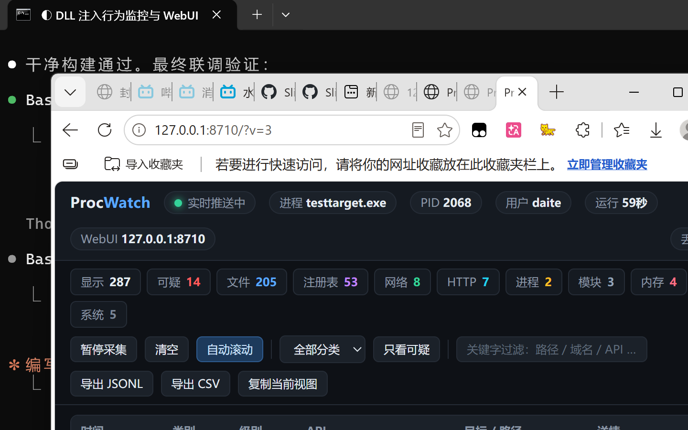

# ProcWatch — 进程行为监控

[](https://github.com/Slingerspir/procwatch/actions/workflows/build.yml)

[English](README.en.md)

把一个 DLL 注入到任意 Windows 进程里，实时展示这个进程**到底做了什么**：读了哪些文件、
写了哪些注册表键、连了哪些地址、发了什么 HTTP 请求、用了什么代理、启动了哪些子进程、
加载了哪些模块、申请了什么内存。

注入后目标进程会多出一个监控窗口，同时该进程内会起一个 WebUI 服务器，浏览器里能看同一份
实时数据。附带一个我自己写的测试靶机 `testtarget.exe`，它会故意把上述每一类行为都做一遍，
用来验证监控端确实抓得到。




---

## 快速开始

```bat
:: 1. 编译（需要 MinGW-w64 gcc 在 PATH 里）
make

:: 2. 启动聚合控制台 + 注入测试靶机
dist\injector.exe --exe dist\testtarget.exe --hub

:: 3. 浏览器打开控制台，点进目标进程
::    http://127.0.0.1:8700/
```

注入到已经在运行的进程：

```bat
dist\injector.exe --list                  :: 先看有哪些进程已被监控
dist\injector.exe --pid 1234              :: 注入到 PID 1234
dist\injector.exe --pid 1234 --previews=1 :: 顺便记录读写/收发的数据预览
```

编译产物：

| 文件 | 说明 |
|---|---|
| `dist/ProcWatch.dll` | 注入用的监控模块（x64） |
| `dist/injector.exe` | 注入器 + 聚合控制台 |
| `dist/testtarget.exe` | 测试靶机 |

---

## 注入器用法

```
injector.exe --exe <程序> [-- <目标自己的参数>]   启动并注入
injector.exe --pid <PID>                          注入到运行中的进程
injector.exe --list                               列出已监控进程
injector.exe --hub [--hub-port N]                 启动聚合控制台
```

| 选项 | 默认 | 说明 |
|---|---|---|
| `--dll <路径>` | 与本程序同目录的 `ProcWatch.dll` | 要注入的 DLL |
| `--gui=0\|1` | 1 | 目标进程内的监控窗口 |
| `--http=0\|1` | 1 | 内嵌 WebUI 服务器 |
| `--port=N` | 自动 | 指定 WebUI 端口（默认从 8710 起探测） |
| `--log=0\|1` | 0 | 事件同时落盘到 `%TEMP%\ProcWatch\logs\` |
| `--previews=0\|1` | 0 | 记录读写/收发的数据预览（文本或十六进制） |
| `--risk=0\|1` | 1 | 可疑行为规则引擎 |
| `--lang=auto\|zh\|en` | auto | 界面语言（跟随系统，可强制指定） |
| `--verbose=0\|1` | 0 | 记录高频 API（如全部 `GetProcAddress`） |
| `--ring=N` | 8192 | 事件环形缓冲条数 |

`--` 之后的内容原样传给目标程序；其余无法识别的参数也会传给目标。

### 目标要求管理员权限时

如果目标程序的清单里声明了 `requireAdministrator`（比如很多游戏启动器），非提权状态下
`CreateProcess` 会失败并返回 **错误码 740**（`ERROR_ELEVATION_REQUIRED`）。这时注入器会
**自动通过 UAC 以管理员身份重启自己**，把原始命令行原样转发过去，新窗口里继续同样的操作。

注入到已经运行的高完整性进程同理：`OpenProcess` 会返回拒绝访问，本程序也必须提权。
两种情况都不受 `SE_DEBUG` 影响——只有提权才行。

不想自动提权就加 `--no-elevate`，它会打印提示让你自己用管理员 cmd 重跑。

验证这条分支（不需要管理员、也不碰任何真实程序）：

```bat
make fixture
dist\injector.exe --exe build\elevation_fixture.exe --no-elevate
```

---

## 监控了什么

按类别列出被挂钩的 API（共 79 个，覆盖 6 个系统模块的导出）：

**文件** `CreateFileA/W` `ReadFile` `WriteFile` `DeleteFileA/W` `MoveFileExW` `CopyFileW`
`CreateDirectoryW` `RemoveDirectoryW` `FindFirstFileW/ExW` `SetFileAttributesW` `CloseHandle`

**注册表** `RegOpenKeyExA/W` `RegCreateKeyExA/W` `RegSetValueExA/W` `RegQueryValueExA/W`
`RegDeleteValueA/W` `RegDeleteKeyA/W/ExW`
（键路径通过 `NtQueryKey` 从句柄反解，所以拿到的是 `HKCU\...` 这样的完整路径）

**网络** `socket` `connect` `WSAConnect` `send` `recv` `WSASend` `WSARecv` `sendto`
`recvfrom` `closesocket` `getaddrinfo` `GetAddrInfoW` `gethostbyname`

**HTTP / 代理** `InternetOpenA/W` `InternetConnectW` `InternetOpenUrlW` `HttpOpenRequestW`
`HttpSendRequestW` `InternetReadFile` `InternetSetOptionW`（代理变更）
`WinHttpOpen` `WinHttpConnect` `WinHttpOpenRequest` `WinHttpSendRequest`
`WinHttpReceiveResponse` `WinHttpSetOption` `WinHttpGetProxyForUrl`
`WinHttpGetIEProxyConfigForCurrentUser`

**进程 / 模块** `CreateProcessA/W` `CreateProcessAsUserW` `WinExec` `ShellExecuteExW`
`LoadLibraryA/W/ExW` `GetProcAddress`

**内存** `VirtualAlloc` `VirtualProtect` `VirtualAllocEx` `VirtualProtectEx`
`WriteProcessMemory` `CreateRemoteThread` `OpenProcess` `QueueUserAPC`

事件里带的信息不止是"调用了什么"：文件操作带访问掩码和打开模式，读写带字节数，
HTTP 带 User-Agent / Host / Content-Type 等关键头，进程创建带完整命令行和隐藏窗口标记，
内存操作带前后权限（`PAGE_EXECUTE_READWRITE` 会被直接标红）。

### 可疑行为规则

规则命中会标成红色并附上原因，规则本身是启发式的、可读的（`src/pw_rules.c`）：

- 写入自启动/持久化位置（Startup 目录、`CurrentVersion\Run`、`Services` 等）
- 在可写目录（Temp / AppData / Downloads / ProgramData）**落地可执行文件**
- 从可写目录**启动**可执行文件
- 访问浏览器凭据库、`wallet.dat`、`.ssh\id_rsa`、`SAM` 等敏感文件
- 用编码/隐藏参数启动系统自带工具（`powershell -enc`、`mshta`、`certutil` …）
- 申请可写可执行内存、跨进程写内存、远程建线程、向线程插 APC
- 修改 hosts、Defender 排除项、系统代理设置
- 加载临时目录下的 DLL

持久化与落地类规则只在**写操作**上触发——枚举一次 Startup 目录不算，往里拷文件才算。

---

## WebUI

每个被注入的进程内跑一个只监听 `127.0.0.1` 的 HTTP 服务器：

| 接口 | 说明 |
|---|---|
| `GET /` | 仪表盘（单文件，无外部依赖，离线可用） |
| `GET /api/meta` | 进程信息、配置、挂钩计数 |
| `GET /api/events?after=N&limit=M` | 拉事件 |
| `GET /api/stream` | SSE 实时推送（断了自动退回轮询） |
| `GET /api/stats` | 分类/等级计数 |
| `GET /api/hooks` | 挂钩清单及每个钩子的命中数 |
| `GET /api/modules` | 目标进程已加载模块 |
| `GET /api/export?format=jsonl\|csv` | 导出全部事件 |
| `POST /api/clear` · `POST /api/pause?on=1` | 清空 / 暂停采集 |
| `POST /api/config?previews=1&verbose=1` | 运行时改配置 |
| `POST /api/deactivate` | **还原全部导入表补丁**，停止监控 |

页面功能：分类/等级/关键字过滤、只看可疑、自动滚动、行点击看详情、
复制当前视图、导出 JSONL/CSV。

`injector.exe --hub` 提供的聚合控制台（`:8700`）会把本机所有被监控进程列在一张表里，
带事件数/可疑数/运行时长，并可直接跳到各自的 WebUI 或停用监控。

---

## 它是怎么工作的

### 挂钩方式：改导入表，不碰导出表

遍历每个已加载模块的**导入地址表（IAT）**，把指向我们目标的项替换成我们的钩子。x64 的
IAT 项是 8 字节绝对指针，所以钩子代码放在自己的 DLL 里也能精确写入任意模块的表。

**为什么不改导出表（EAT）**：导出表项是**相对于所属模块基址的 32 位 RVA**。钩子代码在
`ProcWatch.dll` 里，基址与 `user32.dll` 相差甚远，写进去的 32 位值会被截断成野指针——
任何通过导出表解析到该函数的调用都会跳到未映射内存。实测下来，改 `user32` 导出表的瞬间，
只要有任何东西给窗口应用主题就会崩溃。

导出表本来能提供的两件事，用更便宜的方式补上了：

- **动态解析**：挂钩 `GetProcAddress`，解析到我们目标时返回我们的钩子（顺便让"运行时解析
  API"这个典型规避手法变得可见）。
- **后加载模块**：挂钩 `LoadLibrary*`，新模块一加载就改写它的导入表。

系统模块（kernel32/kernelbase/advapi32/ws2_32/...）**自身**的导入表会被跳过，否则一个
ANSI 调用内部转发到宽字符版本会被重复记录。应用自己的模块、CRT（msvcrt/ucrtbase）都在
覆盖范围内——大部分真实文件 I/O 都是从 CRT 进来的。

所有改动过的槽位都会被记录下来，`POST /api/deactivate` 能逐字节还原（实测 109 处补丁
全部还原后目标进程继续正常运行）。

### 启动顺序：先装钩子，再放目标跑

编译器的常规优化会把 IAT 读取**提升到函数入口**：

```
14000307d:  mov  0x84e4(%rip),%r12    # 14000b568 <__imp_CreateFileA>
```

之后整个函数都通过 `%r12` 调用。如果目标线程在导入表被改写**之前**就开始跑，它会把原函数
地址缓存进寄存器，后面所有调用都绕开钩子——现象是"补丁明明打上了，钩子却从不被调用"。

所以注入器在注入前先创建一个命名事件 `Local\ProcWatchReady_<pid>`，DLL 装完钩子后
`SetEvent`，注入器**等到这个信号才 `ResumeThread`**。这样自动启动的目标是全量被监控的。

### 线程与抑制

监控自身也会做文件/网络 I/O（写日志、跑 HTTP 服务器、画窗口）。这些工作全部运行在自己
的线程上，并置位 TLS 抑制标志，所以不会被记成"目标的行为"。钩子本身只做内存拷贝进环形
缓冲——不分配内存、不调用任何被挂钩的 API，因此不存在递归。

### 落到磁盘的东西

| 路径 | 内容 |
|---|---|
| `%TEMP%\ProcWatch\<pid>.json` | 发现文件，聚合控制台据此枚举实例 |
| `%TEMP%\ProcWatch\trace-<pid>.log` | 启动追踪（挂钩安装过程的逐步记录） |
| `%TEMP%\ProcWatch\logs\*.jsonl` | 事件落盘（需要 `--log=1`） |
| `%TEMP%\ProcWatch\config.ini` | 持久化的默认配置 |

`trace-<pid>.log` 值得单独说一句：注入进别人的进程后没有 stdout 可用，出问题时进程往往
在你能观察到任何东西之前就没了。这个文件是唯一可靠的启动记录。

---

## 测试靶机

`testtarget.exe` 会依次做一遍所有行为，每步之间留 1.2 秒方便观察，跑完保持运行 5 分钟。
所有产物（文件、注册表键、子进程、释放的副本）都会清理。

```
testtarget.exe            正常跑一遍后保持运行
testtarget.exe --fast     无间隔
testtarget.exe --once     跑完退出
testtarget.exe --hold 60  跑完后保持 60 秒
```

里面有两处是**刻意的探测**，都在输出里明确标注：

- **凭据路径探测**：只尝试 `CreateFile` 打开浏览器 `Login Data`、`key4.db`、`.ssh\id_rsa`
  等路径。这些文件通常不存在，打开会失败——**失败本身就是重点**，因为检测工具关心的是
  "尝试访问"这个动作。不读取、不上传任何内容。
- **自启动写入模拟**：写一个路径形状与 Run 键相同的键，但位置在
  `HKCU\Software\ProcWatchTest\CurrentVersion\Run` 下，写完立刻删除。**不碰真实的 Run 键。**

想验证持久化规则的真实效果，自己往 `shell:startup` 里放个快捷方式即可。

---

## 语言

界面（注入器、进程内窗口、事件日志、规则说明、WebUI、测试靶机）都是中英双语的。中文原文就是
查找键，所以缺翻译会退回中文而不是空白，`tools/check_lang.py` 会在译文漏掉或打乱 `printf`
格式说明符时让构建失败。

```bat
dist\injector.exe --exe dist\testtarget.exe --lang=en
```

默认跟随系统 UI 语言。译文在 `tools/lang_en.tsv`，由 `tools/gen_lang.py` 编译进 DLL 和
WebUI 的字典。

---

## 已知限制

写在前面，因为这些是真实存在的边界，不是"待办"：

1. **位数必须匹配。** 当前只构建 x64。注入到 32 位进程会失败（`LoadLibrary` 返回 0）。
2. **`--pid` 注入到运行中的进程，早期调用可能漏记。** 见上文"启动顺序"：已经在跑的进程
   里，某些函数指针可能早就被编译器提升进寄存器了，之后一直用旧地址，钩子拦不到。**要
   完整覆盖请用 `--exe` 启动模式**——那条路径是等钩子装好才放行的。目标进程启动时间越长、
   之前跑的代码越多，漏记的比例越高。
3. **只覆盖通过导入表 / `GetProcAddress` 的调用。** 直接走 `ntdll` 系统调用（自己解析
   `NtCreateFile` 等）的样本不会被记录。要覆盖那一层需要内核回调或 `ntdll` 内联挂钩。
4. **受保护进程注入不进去。** PPL / 反作弊保护的进程会拒绝 `CreateRemoteThread`。
   启用 ACG（代码完整性）的进程也可能让 `VirtualProtect` 失败，此时导入表补丁会被跳过
   （代码会记录失败而不是静默装作成功）。
5. **注入器和目标必须同级别。** 目标是管理员权限时，注入器也得提权（见上文）。
6. **进程内窗口需要桌面访问权限。** 服务（session 0）里创建窗口会失败，此时只有 WebUI
   可用——这是有意降级，不会影响采集。
7. **规则是启发式的。** 会误报也会漏报。每条命中都附了原因，没有黑盒判断。
8. **WebUI 无认证。** 只监听 `127.0.0.1`，设计上是本机调试面板而不是网络服务。

---

## 代码结构

```
src/
  pw_common.h        共用定义（事件结构、配置、恢复事件名）
  pw_util.c/h        字符串/路径/编码/JSON 工具
  pw_events.c/h      加锁的环形缓冲，按 seq 拉取
  pw_config.c/h      三级配置加载（默认 → config.ini → 环境变量/pending.ini）
  pw_state.c/h       全局状态、TLS 抑制标志、上报入口、启动追踪
  pw_rules.c/h       启发式规则引擎
  pw_hooks.c/h       挂钩引擎：按名改写导入表 + 还原
  pw_hookapi.c       文件/注册表/网络/WinINet/进程/模块/内存钩子
  pw_hookapi_winhttp.c  WinHTTP 钩子（单独编译单元，MinGW 头文件冲突）
  pw_hookutil.h      钩子间共用的内联助手
  pw_json.c          事件 → JSON
  pw_gui.c/h         进程内虚拟列表窗口
  pw_http.c/h        内嵌 HTTP 服务器 + SSE
  pw_dll.c           DllMain 与编排线程
  injector.c         注入器 / 聚合控制台
  testtarget.c       测试靶机
web/
  webui.html         仪表盘（构建时嵌入 DLL）
  hub.html           聚合控制台（构建时嵌入 injector）
tools/
  embed.c            HTML → C 字节数组
  probe.c            诊断：比对 GetProcAddress 与导入表绑定结果
  screenshot.ps1     截图辅助脚本
```

MIT — 见 [LICENSE](LICENSE)。
